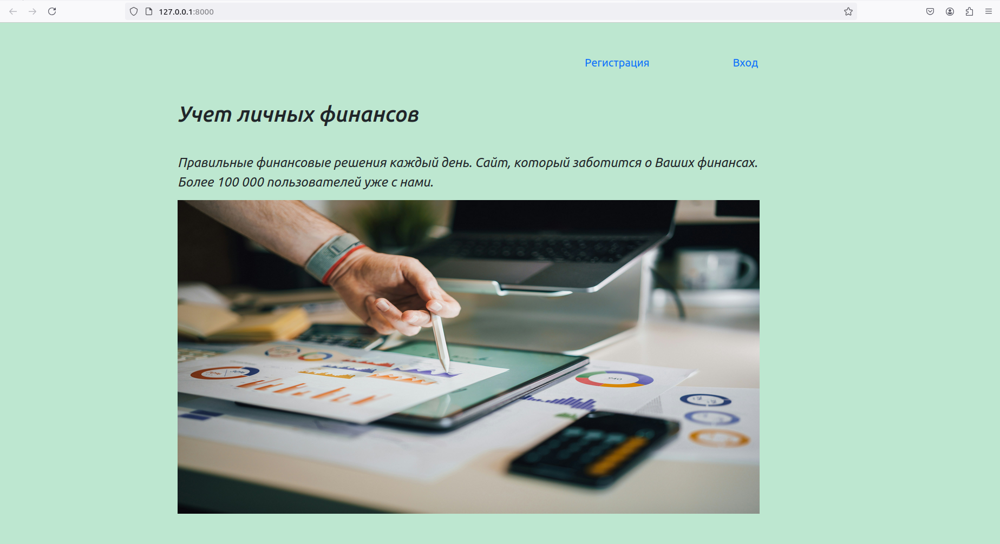
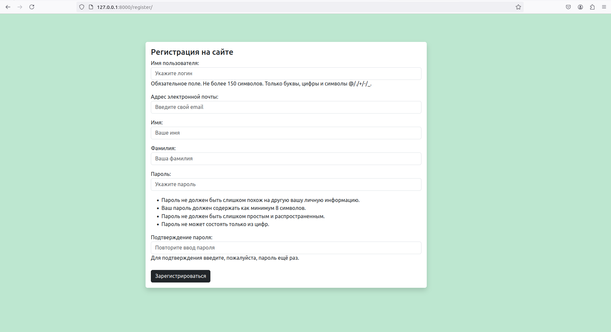
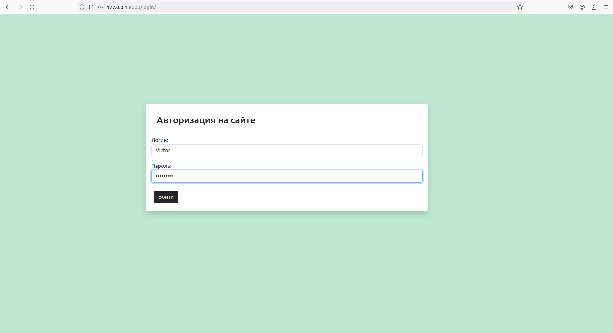
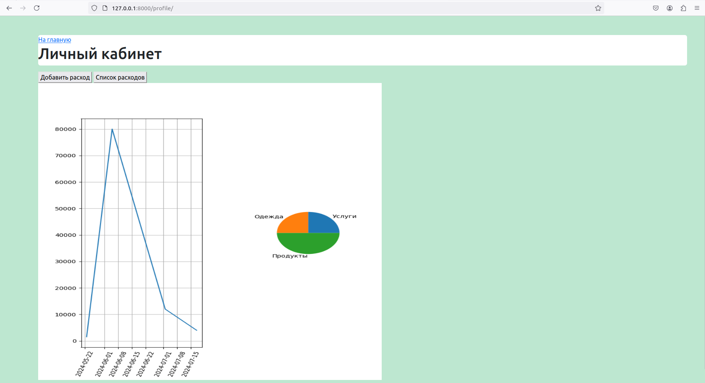
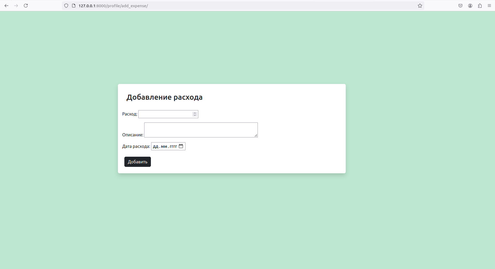
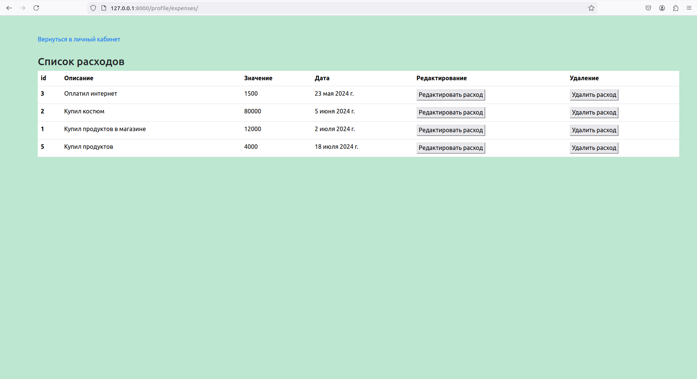
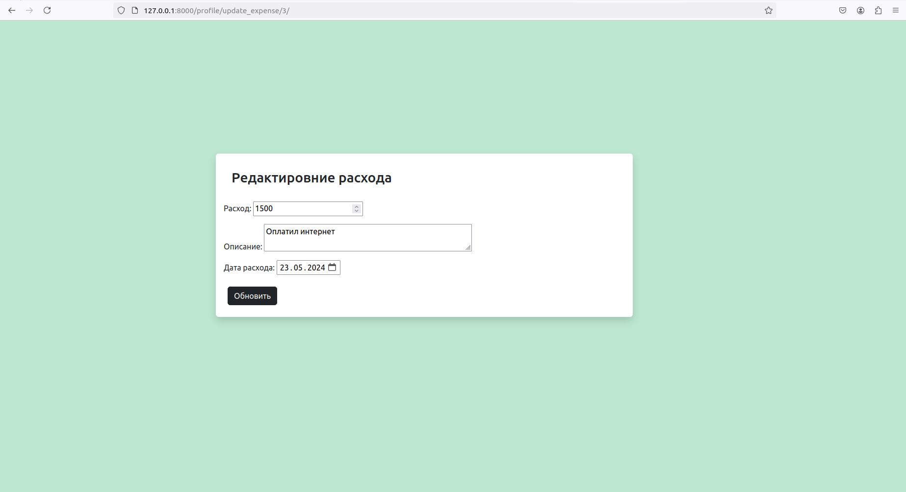

# Веб-приложение для мониторнига расходов

### Краткое описание проекта
Веб-приложение для отслеживания личных финансов, позволяющее пользователям вводить и
анализировать свои расходы, включены функции искусственного интеллекта для улучшения
пользовательского опыта и анализа данных.


### Инструкции по установке и настройке:
1. Установить зависимости проекта
   ``` commandline
   pip install -r requirements.txt
   ```
2. Переименовать файл .env_example в .env
3. Перейти в папку проекта
   ``` commandline 
   cd FinanaceTracking
   ```
   
4. Запустить консоль Django, импортировать utils, сгенирировать SECRET_KEY
   ``` commandline
   python manage.py shell
   ```
   ``` commandline
   from django.core.management import utils
   ```
   ``` commandline
   utils.get_random_secret_key()
   ```  
   
5. Заполнить файл .env
6. Создать и применить миграции
   ``` commandline
   python manage.py makemigrations 
   ```
   ``` commandline
   python manage.py migrate
   ``` 

7. Создать суперпользователя для управления админ-панелью
   ``` commandline
   python manage.py createsuperuser
   ```
   
8. Добавить тестовые данные в БД
9. Запустить локальный сервер разработки Django
    ``` commandline
    python manage.py runserver
    ```
10. Перейти по ссылке: http://127.0.0.1:8000

### Примеры использования
#### главная страница сайта
<p align="center">
  
</p>

#### регистрация на сайте
<p align="center">
  
</p>

#### авторизация на сайте
<p align="center">
  
</p>

#### личный кабинет
<p align="center">
  
</p>

#### добавление расхода
<p align="center">
  
</p>

#### список расходов
<p align="center">
  
</p>

#### редактирование расхода
<p align="center">
  
</p>


### Описание основных функций

1. Регистрация и аутентификация пользователей. Выполнена стандартными средствами Django.
2. Добавление, редактирование и удаление расходов.
3. Категоризация расходов. Категоризация расходов выполнена с использованием NLP (автоматическое определение категории
расходов на основе текста описания, используя модели обработки естественного языка
(NLP).
4. Визуализация данных( отображение расходов в виде графиков и диаграмм, предусмотрены
круговая диаграмма для категорий расходов, линейный график для ежемесячных
расходов).

### Список используемых технологий и библиотек
<ul>
  <li> Backend: Django </li>
  <li> Frontend: Django templates </li>
  <li> База данных: PostgreSQL </li>
  <li> Библиотеки: Pandas для анализа данных, Matplotlib для визуализации, spaCy для NLP, scikit-learn для 
  машинного обучения </li>
</ul>


